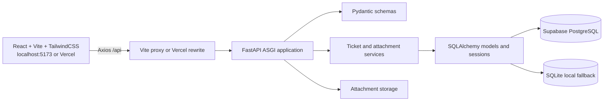
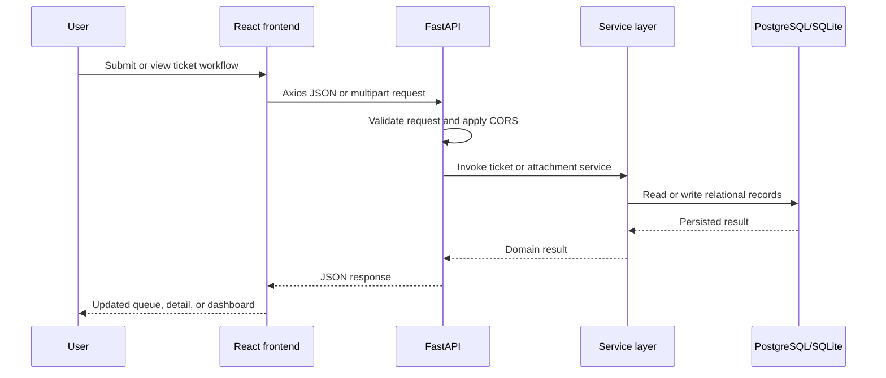
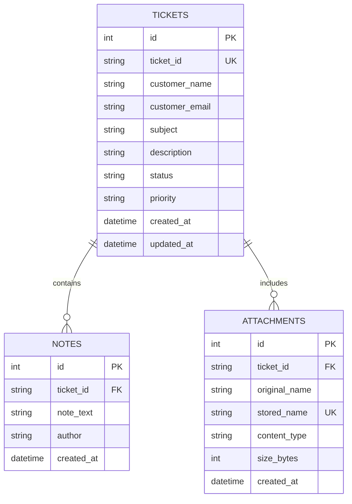

# TicketlyCRM
## Technical Project Documentation

**Developer:** Ansari Mohammed Sameer  
**Submission:** Datastraw Technical Assessment  
**Date:** 18 September 2026  
**Document version:** 1.0

> This document describes the implemented repository as inspected on 18 September 2026. It does not describe unimplemented product behavior.

---

## Table of Contents

1. [Executive Summary](#1-executive-summary)
2. [Project Objectives](#2-project-objectives)
3. [Technology Stack](#3-technology-stack)
4. [System Architecture](#4-system-architecture)
5. [Database Design](#5-database-design)
6. [API Documentation](#6-api-documentation)
7. [UI Documentation](#7-ui-documentation)
8. [Feature Documentation](#8-feature-documentation)
9. [Bonus Feature: Ticket Priority System](#9-bonus-feature-ticket-priority-system)
10. [Application Workflow](#10-application-workflow)
11. [Testing Report](#11-testing-report)
12. [Deployment Guide](#12-deployment-guide)
13. [Challenges and Solutions](#13-challenges-and-solutions)
14. [Future Enhancements](#14-future-enhancements)
15. [Conclusion](#15-conclusion)

---

## 1. Executive Summary

### Project Overview

TicketlyCRM is a customer support ticket management CRM. It provides a focused workspace for capturing customer issues, assigning priority, searching and filtering the support queue, updating ticket status, preserving internal notes, reviewing operational metrics, and attaching supporting files.

The application is implemented as a React single-page frontend backed by a FastAPI REST API. SQLAlchemy provides the persistence boundary, Supabase PostgreSQL is the production database, SQLite is available as a local fallback when no database URL is configured, and Vercel provides deployment and API rewrites.

### Purpose

The purpose of TicketlyCRM is to give support agents a single, understandable workflow from customer intake through triage, investigation, and resolution.

### Problem Statement

Support teams need to process several customer requests at different levels of urgency. Without a structured ticket record, visible priority, searchable queue, and status lifecycle, critical issues can be delayed and context can be lost during handoffs.

### Solution Provided

TicketlyCRM combines validated ticket intake, four-level priority management, status controls, internal notes, attachments, dashboard metrics, analytics, and responsive navigation. The implementation emphasizes a small and maintainable operational core rather than a large set of shallow features.

### Implemented Scope Boundary

Authentication is currently browser-local: accounts and sessions are stored in local storage for the assessment environment. It is not a production identity provider or server-side authorization system. The API has no DELETE operation; closing a ticket is the implemented resolution action and preserves history.

## 2. Project Objectives

- Capture complete customer issue details with validation.
- Give agents an efficient ticket queue for search, filtering, and sorting.
- Make customer impact visible through Low, Medium, High, and Critical priority levels.
- Support an explicit Open, In Progress, and Closed lifecycle.
- Preserve internal investigation context through notes and attachments.
- Provide dashboard and analytics views for operational awareness.
- Keep the frontend, backend, database, and deployment boundaries clear.
- Provide a practical local development workflow at ports 5173 and 8000.
- Maintain a deployment path compatible with Vercel and Supabase.

## 3. Technology Stack

| Layer | Technology | Implemented responsibility |
| --- | --- | --- |
| Frontend | React 18 | Component-based user interface and state |
| Build and development | Vite | Local dev server, proxy, and production build |
| Styling | TailwindCSS, PostCSS, Autoprefixer | Responsive layout and visual system |
| Routing | React Router DOM | Public and protected page routes |
| HTTP client | Axios | API requests, timeout handling, and user-facing errors |
| Charts | Recharts | Dashboard and Analytics visualizations |
| Motion | Framer Motion | Frontend interaction and presentation support |
| Icons and notifications | Lucide React, React Hot Toast | UI icons and operation feedback |
| Backend | FastAPI, Uvicorn | REST API and ASGI runtime |
| Validation | Pydantic, email-validator | Request and response contracts |
| Persistence | SQLAlchemy | Models, relationships, sessions, and queries |
| Database | Supabase PostgreSQL | Production relational storage |
| Local database | SQLite | Local fallback when `DATABASE_URL` is absent |
| Deployment | Vercel | Vite hosting and Python API rewrites |
| File handling | python-multipart, FastAPI UploadFile | Validated attachment uploads |

### Repository Structure

```text
api/                         Vercel ASGI entry point
backend/main.py              FastAPI application
backend/app/api/             Ticket, note, and attachment routes
backend/app/models/          Ticket, note, attachment, and sequence models
backend/app/schemas/         Pydantic contracts
backend/app/services/        Ticket and attachment business logic
backend/app/database/        Engine, sessions, migrations, health checks
backend/tests/               API and Vercel routing tests
frontend/src/components/     React pages, shell, authentication, and UI
frontend/src/js/api.js       Axios API client
schema/                      PostgreSQL schema and migrations
vercel.json                  Vercel build and rewrite configuration
docs/                        Project documentation and Supabase guidance
```

## 4. System Architecture

### Frontend Architecture

The frontend is a React single-page application. `AppRoutes` separates public Login and Signup routes from protected workspace routes. `AppShell` provides the shared sidebar, navbar, content outlet, and footer. Page components call the shared Axios client in `frontend/src/js/api.js`.

The API client uses `/api` when deployed and uses `http://localhost:8000/api` during local development unless `VITE_API_URL` overrides it. Vite proxies local `/api` requests to the FastAPI process.

### Backend Architecture

`backend/main.py` creates the FastAPI application, mounts uploads, configures CORS, registers health endpoints, includes the ticket router, initializes database metadata, and maps SQLAlchemy failures to structured JSON errors.

`backend/app/api/tickets.py` defines HTTP routes. Service modules contain business operations. Pydantic schemas define accepted and returned data. SQLAlchemy models represent persisted entities.

### Database Architecture

The production schema is PostgreSQL-compatible and is supplied in `schema/supabase_schema.sql` plus the migration in `schema/migrations/20260918_ticket_integrity_and_attachments.sql`. The application uses `ticket_id` as the stable business identifier for related notes and attachments.

### Deployment Architecture

Vercel builds the frontend from `frontend/` and serves the generated `dist/` directory. Rewrites route `/api/*` to `api/index.py`, which adapts the request path before invoking the FastAPI application. Supabase PostgreSQL is configured through Vercel environment variables.

### Mermaid Architecture Diagram



### API Flow



## 5. Database Design

### Tables

| Table | Purpose | Primary key |
| --- | --- | --- |
| `tickets` | Customer support work items | `id`; unique business key `ticket_id` |
| `notes` | Internal ticket notes | `id` |
| `attachments` | Attachment metadata and stored-file reference | `id` |
| `ticket_sequences` | Database-owned human-readable ticket counter | `sequence_key` |

### `tickets`

| Field | Type | Notes |
| --- | --- | --- |
| `id` | Integer / serial | Internal primary key |
| `ticket_id` | VARCHAR(32) | Unique identifier such as `TKT-1033` |
| `customer_name` | VARCHAR | Required customer name |
| `customer_email` | VARCHAR | Required validated email |
| `subject` | VARCHAR(255) | Required issue title |
| `description` | TEXT | Required issue detail |
| `status` | VARCHAR | `Open`, `In Progress`, or `Closed` |
| `priority` | VARCHAR | `Low`, `Medium`, `High`, or `Critical` |
| `created_at` | TIMESTAMPTZ | Creation timestamp |
| `updated_at` | TIMESTAMPTZ | Last change timestamp |

### `notes`

| Field | Type | Notes |
| --- | --- | --- |
| `id` | Integer / serial | Primary key |
| `ticket_id` | VARCHAR(32) | Foreign key to `tickets.ticket_id` |
| `note_text` | TEXT | Internal note content, max 5,000 characters |
| `author` | VARCHAR | Defaults to Support Agent |
| `created_at` | TIMESTAMPTZ | Note timestamp |

### `attachments`

| Field | Type | Notes |
| --- | --- | --- |
| `id` | Integer / serial | Primary key |
| `ticket_id` | VARCHAR(32) | Foreign key to `tickets.ticket_id` |
| `original_name` | VARCHAR(255) | User-facing filename |
| `stored_name` | VARCHAR(255) | Unique generated filename |
| `content_type` | VARCHAR(100) | Uploaded MIME type |
| `size_bytes` | Integer | Between 1 byte and 10 MB |
| `created_at` | TIMESTAMPTZ | Upload timestamp |

### `ticket_sequences`

| Field | Type | Notes |
| --- | --- | --- |
| `sequence_key` | Integer | Single-row key constrained to 1 |
| `next_value` | Integer | Next ticket number, minimum 1001 |

### Relationships and Data Flow

- One ticket has many notes.
- One ticket has many attachments.
- Notes and attachments reference the stable `ticket_id` value.
- Foreign keys use cascade behavior when a ticket is removed at the database level.
- Ticket creation obtains a sequence-backed identifier before commit.
- Ticket updates modify status, priority, timestamps, and optional notes.
- Attachment upload writes the file and commits its metadata.



## 6. API Documentation

The canonical frontend and deployment prefix is `/api`. The backend also mounts the ticket router at `/tickets` for compatibility. FastAPI's generated documentation is available at `/docs` while the server is running.

### Health Endpoints

#### `GET /api/health`

**Purpose:** Reports API status and the result of a database connectivity check.

**Request:** No body.

**Response `200`:**

```json
{
  "api": "operational",
  "database": "connected",
  "database_type": "Supabase PostgreSQL",
  "version": "1.0.0",
  "timestamp": "2026-09-18T17:00:22+00:00"
}
```

Equivalent health routes implemented by FastAPI are `/`, `/health`, `/api`, `/api/index.py`, and `/api/index`.

### `GET /api/tickets`

**Purpose:** Lists tickets with optional search, status filter, priority filter, and sorting.

**Query example:**

```text
GET /api/tickets?status=Open&priority=Critical&search=account&sort=priority
```

**Response `200`:**

```json
[
  {
    "ticket_id": "TKT-1033",
    "customer_name": "Rachel Green",
    "customer_email": "rachel@example.com",
    "subject": "Unable to access account",
    "description": "The customer cannot complete sign-in.",
    "status": "Open",
    "priority": "Critical",
    "created_at": "2026-09-18T12:00:00Z"
  }
]
```

**Status codes:** `200`, `503` database unavailable, `500` database error, `422` invalid query values.

### `POST /api/tickets`

**Purpose:** Creates a new ticket with status `Open` and a generated ticket ID.

**Request example:**

```json
{
  "customer_name": "Rachel Green",
  "customer_email": "rachel@example.com",
  "subject": "Unable to access account",
  "description": "The customer cannot complete sign-in.",
  "priority": "High"
}
```

**Response `201`:**

```json
{
  "ticket_id": "TKT-1033",
  "created_at": "2026-09-18T12:00:00Z"
}
```

**Status codes:** `201`, `400`, `422`, `503`.

### `GET /api/tickets/stats/summary`

**Purpose:** Returns total, status, and priority counts for Dashboard and Analytics.

**Request:** No body.

**Response `200`:**

```json
{
  "total": 32,
  "open": 1,
  "in_progress": 23,
  "closed": 8,
  "priorities": {"Low": 2, "Medium": 4, "High": 2, "Critical": 24}
}
```

**Status codes:** `200`, `503`, `500`.

### `GET /api/tickets/{ticket_id}`

**Purpose:** Returns one ticket with notes and attachment metadata.

**Request example:** `GET /api/tickets/TKT-1033`

**Response `200`:**

```json
{
  "ticket_id": "TKT-1033",
  "customer_name": "Rachel Green",
  "customer_email": "rachel@example.com",
  "subject": "Unable to access account",
  "description": "The customer cannot complete sign-in.",
  "status": "Open",
  "priority": "High",
  "created_at": "2026-09-18T12:00:00Z",
  "updated_at": "2026-09-18T12:00:00Z",
  "notes": [],
  "attachments": []
}
```

**Status codes:** `200`, `404`, `503`, `500`.

### `PUT /api/tickets/{ticket_id}`

**Purpose:** Updates status and/or priority and can append note content.

**Request example:**

```json
{
  "status": "In Progress",
  "priority": "Critical",
  "notes": "Engineering investigation started."
}
```

**Response `200`:**

```json
{
  "success": true,
  "updated_at": "2026-09-18T12:15:00Z"
}
```

**Status codes:** `200`, `404`, `422`, `503`, `500`.

### `POST /api/tickets/{ticket_id}/notes`

**Purpose:** Adds an internal note to a ticket.

**Request example:**

```json
{
  "note_text": "Customer contacted by phone.",
  "author": "Support Agent"
}
```

**Response `201`:**

```json
{
  "id": 14,
  "ticket_id": "TKT-1033",
  "note_text": "Customer contacted by phone.",
  "author": "Support Agent",
  "created_at": "2026-09-18T12:20:00Z"
}
```

**Status codes:** `201`, `404`, `422`, `503`, `500`.

### `POST /api/tickets/{ticket_id}/attachments`

**Purpose:** Uploads one supported attachment for a ticket.

**Request:** `multipart/form-data` with field `file`. Supported extensions are JPG, JPEG, PNG, PDF, DOC, and DOCX. The maximum size is 10 MB.

**Response `201`:**

```json
{
  "id": 4,
  "original_name": "incident.pdf",
  "content_type": "application/pdf",
  "size_bytes": 24576,
  "url": "/uploads/generated-name.pdf",
  "created_at": "2026-09-18T12:25:00Z"
}
```

**Status codes:** `201`, `400`, `404`, `422`, `503`, `500`.

### `GET /uploads/{stored_name}`

**Purpose:** Serves a stored attachment through FastAPI's static file mount when the file exists.

### DELETE API Status

No DELETE route is implemented for tickets, notes, or attachments. The current workflow uses `Closed` as the resolution state and retains ticket history. Deletion or archival would require authorization, audit logging, and retention rules before being added.

## 7. UI Documentation

### Login Page

The Login page validates a browser-local CRM ID and password, shows validation failure feedback, and redirects authenticated users to the Dashboard. The implementation uses the `AuthContext` provider.

### Dashboard

The Dashboard displays status KPI cards, recent tickets, priority workload, triage links, and quick actions. It calls the statistics and list endpoints and refreshes after ticket mutations.

### Ticket List

The Ticket List supports search, status filter, priority filter, newest/priority sorting, manual refresh, CSV export, pagination presentation, and navigation to ticket details.

### Create Ticket

The Create Ticket page validates customer name, email, subject, description, priority, and optional attachment size before sending the create request. It displays the generated ticket ID and redirects to the detail page after success.

### Ticket Details

Ticket Details shows customer information, subject, description, status, priority, timestamps, notes, and attachments. Users can change status, update priority, add notes, and upload supported files.

### Analytics

Analytics uses Recharts to show status distribution, ticket volume by day, priority breakdown, resolution rate, active workload, and open-triage percentage.

### Settings

Settings shows the current local agent profile, queue and view preferences, refresh/toast preferences, and a periodically refreshed API/database health view.

### Additional Implemented Routes

The codebase also contains a Signup page, Customers page, shared AppShell, Not Found page, footer, and protected route handling. They are part of the current frontend route structure even though they are not separate required sections in this document.

### Screenshots

No application screenshots are present in the repository at documentation-generation time. The repository contains favicon and manifest branding assets only. The UI descriptions above are based on the implemented React components and route definitions.

## 8. Feature Documentation

### Create Ticket

Required customer and issue fields are validated in the UI and again by Pydantic. The backend normalizes customer email casing, assigns status `Open`, generates a ticket ID, and records timestamps.

### Search Tickets

Search is case-insensitive and covers ticket ID, customer name, email, subject, and description. The same query is available from the Ticket List and the global navbar search.

### Status Management

Supported statuses are `Open`, `In Progress`, and `Closed`. Status changes update the ticket timestamp and refresh mounted views.

### Notes

Notes are internal records with text, author, ticket relationship, and timestamp. They are returned with ticket details in descending creation order.

### Dashboard Analytics

The Dashboard and Analytics views aggregate ticket counts and calculate workload and resolution indicators from the ticket and summary endpoints.

### Authentication

The implemented authentication flow includes Login, Signup, protected routes, 12-hour browser-local sessions, local account storage, legacy-key cleanup, and logout confirmation. It is an assessment/demo authentication model, not production identity management.

### Priority System

The four priority values are Low, Medium, High, and Critical. Priority is assigned during creation, can be updated later, can be filtered and sorted, and appears in metrics and charts.

### Responsive Design

Tailwind responsive classes provide adaptive layouts, mobile navigation, stacked forms, responsive metric grids, and desktop/mobile content behavior.

## 9. Bonus Feature: Ticket Priority System

### Why It Was Added

Support teams often manage several issues at once. A visible priority signal prevents urgent customer-impacting requests from being buried in a chronological queue.

### Real-World Business Value

The Low-to-Critical scale gives agents and leads a common language for triage. It helps a team focus first on issues with the greatest operational or customer impact without requiring a full SLA engine.

### How It Helps Support Teams

Priority is persisted in the database, displayed on cards and details, included in summary counts, supported by filters, and used by Critical-first sorting. This makes the feature useful throughout the workflow rather than only at ticket creation.

### Tradeoff Made

I chose to develop one meaningful workflow feature deeply instead of adding many shallow features. The result is a simpler, maintainable application that improves a real support operation immediately. More advanced SLA rules can be added later without changing the current priority contract.

## 10. Application Workflow

```mermaid
flowchart LR
    Login[User Login] --> Dashboard[Dashboard]
    Dashboard --> Create[Create Ticket]
    Create --> Priority[Assign Priority]
    Priority --> Manage[Manage Ticket]
    Manage --> Progress[Update Status]
    Progress --> Notes[Add Notes or Evidence]
    Notes --> Resolve[Resolve Customer Issue]
    Resolve --> Closed[Close Ticket]
    Closed --> Analytics[Dashboard and Analytics refresh]
```



```text
User Login
    -> Dashboard
    -> Create Ticket
    -> Manage Ticket
    -> Update Status
    -> Add Notes / Attachments
    -> Resolve Customer Issue
    -> Closed Ticket
```

## 11. Testing Report

### Functional Testing

| Test case | Expected result | Evidence / result |
| --- | --- | --- |
| List tickets | Returns ticket collection | Backend tests and local endpoint smoke checks |
| Filter by status | Only matching status is returned | Backend test coverage |
| Search by customer | Matching tickets are returned | Backend test coverage |
| Create ticket | Generates `TKT-*` ID and timestamp | Backend test coverage |
| View ticket detail | Returns ticket and related data | Backend test coverage |
| Update status and note | Persists update and returns timestamp | Backend test coverage |
| Upload attachment | Stores file metadata and returns URL | Local API verification |

### API Testing

Required local endpoint checks were performed against the running service:

- `GET /api/health` returned `200`.
- `GET /api/tickets` returned `200`.
- `GET /api/tickets/stats/summary` returned `200`.
- CORS preflight for `http://localhost:5173` returned `200`.
- Vite `/api` proxy forwarded successfully to FastAPI.
- Create, attachment upload, detail, and update workflows returned successful responses during local verification.

### UI Testing

The implemented route structure covers Login, Signup, Dashboard, Create Ticket, Tickets, Ticket Details, Analytics, Customers, Settings, and Not Found states. Loading, error, success, empty, and protected-route states are represented in the relevant components.

### Responsive Testing

Responsive Tailwind variants are implemented for navigation, metric cards, ticket forms, tables, filters, details, and settings. A formal automated browser viewport matrix is not included in the repository.

### Build and Routing Testing

```powershell
python -m compileall -q backend main.py api
npm --prefix frontend run build
python backend/tests/test_api.py
python backend/tests/test_vercel_routing.py
```

## 12. Deployment Guide

### Local Setup

Prerequisites are Node.js 18+, Python 3.10+, and installed project dependencies.

```powershell
python -m venv .venv
.venv\Scripts\activate
pip install -r requirements.txt
Copy-Item .env.example .env
npm install --prefix frontend
```

Start the services in separate terminals:

```powershell
python -m uvicorn main:app --reload --port 8000
npm run dev
```

Open `http://localhost:5173`. The API is available at `http://localhost:8000`, with interactive docs at `/docs`.

### Environment Variables

| Variable | Required | Purpose |
| --- | --- | --- |
| `DATABASE_URL` | Production | Supabase PostgreSQL connection string with SSL |
| `ENVIRONMENT` | No | Environment label |
| `CORS_ORIGINS` | No | Additional comma-separated browser origins |
| `VITE_API_URL` | No | Local frontend API override |
| `UPLOAD_DIR` | No | Writable attachment directory |

Do not commit `.env` or expose database credentials. Configure production secrets in Vercel environment settings.

### Supabase Setup

1. Create a Supabase project.
2. Open the SQL Editor.
3. Run `schema/supabase_schema.sql`.
4. Run `schema/migrations/20260918_ticket_integrity_and_attachments.sql`.
5. Configure `DATABASE_URL` with the Supabase PostgreSQL connection string and SSL enabled.
6. Start the backend and verify `/api/health` reports a connected database.

### Vercel Deployment

`vercel.json` configures:

```text
framework: vite
installCommand: npm --prefix frontend ci --include=dev
buildCommand: npm --prefix frontend run build
outputDirectory: dist
/api/:path* -> /api/index.py?path=/api/:path*
```

Set `DATABASE_URL` and any required `CORS_ORIGINS` in Vercel. Deployed frontend requests use same-origin `/api` routing. In serverless mode, attachment files use temporary storage; durable production attachments require object storage.

## 13. Challenges and Solutions

| Challenge | Implemented solution |
| --- | --- |
| Consistent API behavior in local and Vercel environments | Shared `/api` contract, Vite proxy, Vercel rewrites, and ASGI path middleware |
| Duplicate or inconsistent ticket numbers | `ticket_sequences` table and database-owned next-value allocation |
| Mixed historical status or priority values | Startup normalization and migration logic for known legacy values |
| Database outage visibility | Health check plus structured `503`/`500` SQLAlchemy exception responses |
| Browser-to-API local calls | Explicit localhost CORS origins plus configurable `CORS_ORIGINS` |
| Attachment validation | Extension allowlist and 10 MB size limit before persistence |
| Keeping views synchronized after mutations | Same-tab custom event with refresh fallback |
| Responsive operations UI | Tailwind responsive layout utilities and mobile navigation |

## 14. Future Enhancements

These are enhancements, not claims about the current implementation.

- **File attachment durability:** Move current local/serverless temporary storage to Supabase Storage or another object store. Attachment upload is already implemented; durability is the remaining improvement.
- **Email notifications:** Notify agents or customers when a ticket is created, updated, or closed.
- **Agent assignment:** Add users, queues, ownership, and role-based permissions.
- **SLA tracking:** Add response/resolution targets, timers, escalations, and breach reporting.
- **Production authentication:** Replace browser-local credentials with a managed identity provider and server-side authorization.
- **Real-time collaboration:** Add Supabase Realtime or WebSockets for cross-client updates.
- **Automated browser testing:** Add CI coverage for critical workflows and mobile viewports.
- **Retention and archival:** Define audit and retention policy before adding destructive operations.

## 15. Conclusion

TicketlyCRM provides a practical and maintainable support-ticket workflow with a clear separation between React UI, FastAPI transport, service logic, SQLAlchemy persistence, and Supabase deployment. Its priority system is a small but meaningful operational feature that improves triage throughout the application. The implementation is suitable as an assessment-scale CRM foundation, while the documented next steps identify the security, storage, collaboration, and observability work required for broader production use.
